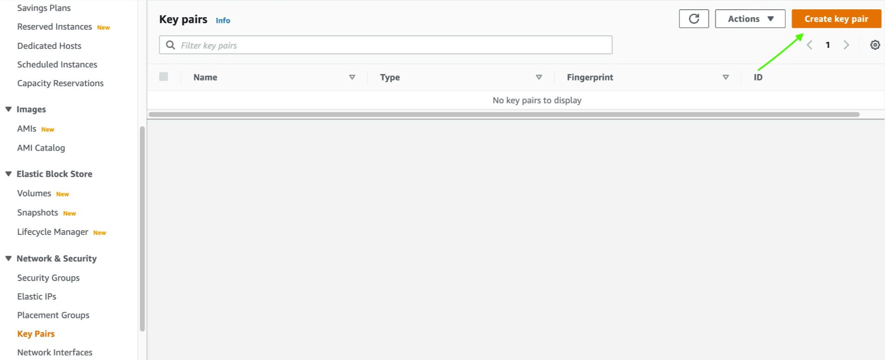
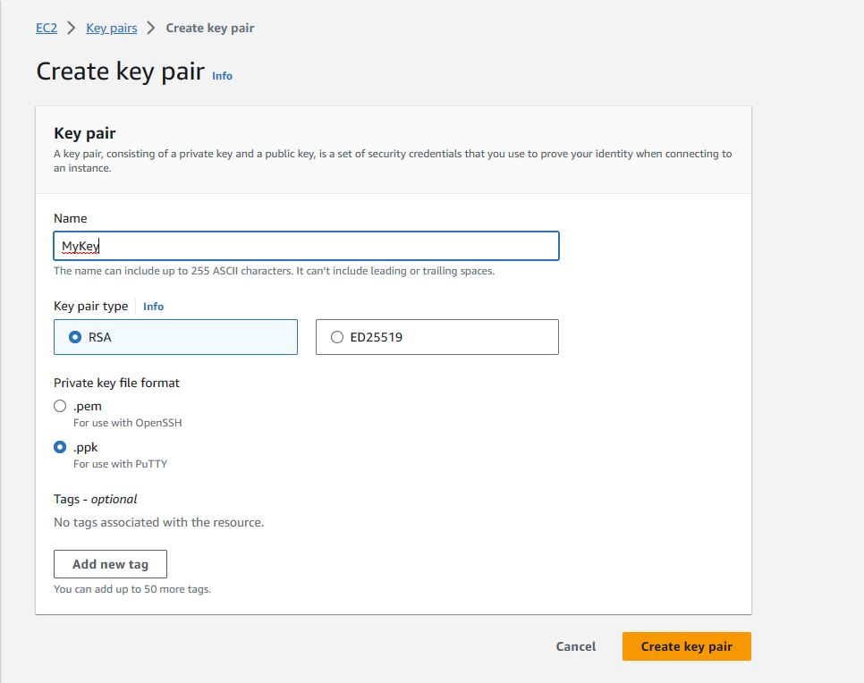
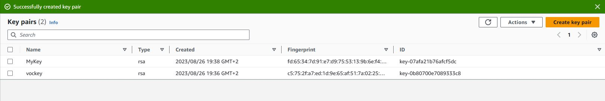
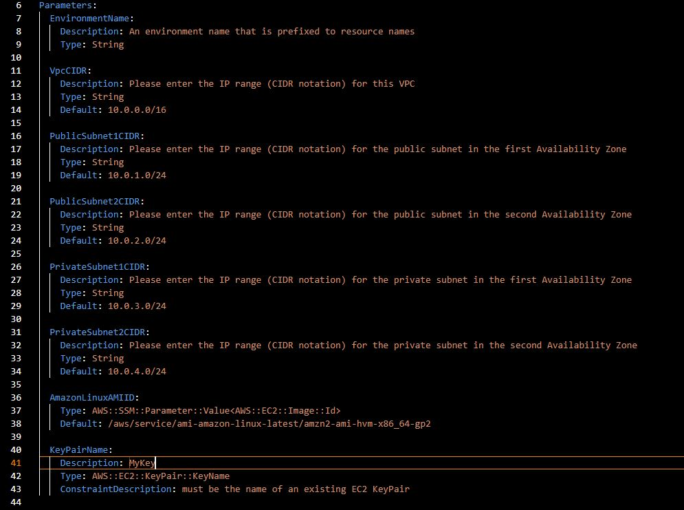
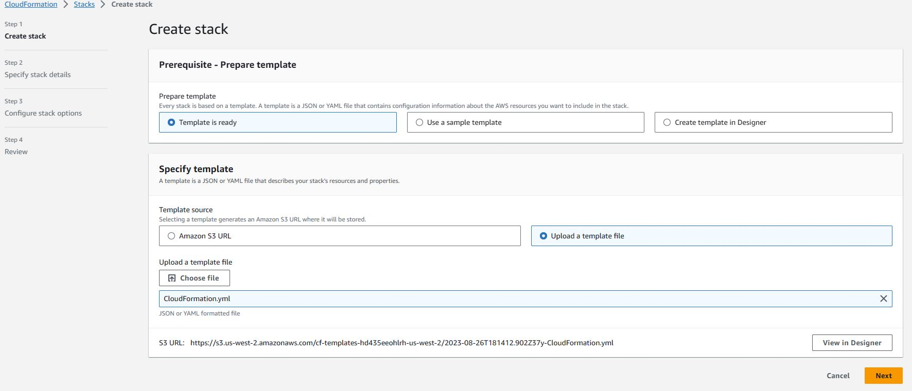
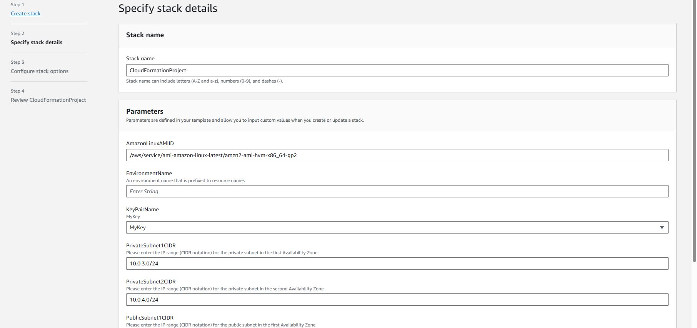

## Objectives

  

- Deploy an AWS CloudFormation stack with a defined Virtual Private Cloud (VPC), and Secuirty Group.

- Configure an AWS CloudFormation stack with resources, such as an Amazon Elastic Compute Cloud (EC2).

  

### Task 1: Create a Key Pair

  

First we’re going to create a Key 🔑 Pair. Later we will need to input the Key Pair information into our CloudFormation template.

  

Navigate to EC2 in the AWS console, scroll down and select Key Pair.

Select “Create key pair”.



Select a Key Pair name, as well as a Private key file format (I selected ppk as I have a Windows machine) and click **“Create key pair”**.





### Task 2: Deploy a CloudFormation Stack

Download the raw .yaml file (CloudFormation.yaml) onto your local environment.

  

**Description:** This template deploys a VPC with a pair of public and private subnets distributed across two Availability Zones. It establishes an internet gateway with a default route on the public subnets, and deploys a NAT gateway with default routes in the private subnets. Additionally, it provisions EC2 instances with associated Security Groups.

  

This template also uses a **special parameter** that is used to provide a value for the Amazon Machine Image (AMI).

```

AmazonLinuxAMIID:

Type: AWS::SSM::Parameter::Value<AWS::EC2::Image::Id>

Default: /aws/service/ami-amazon-linux-latest/amzn2-ami-hvm-x86_64-gp2

```

This parameter uses the **AWS Systems Manager Parameter Store** to retrieve the latest AMI (specified in the Default parameter, which in this case is Amazon Linux 2) for the stack's region. This makes it easy to deploy stacks in different regions without having to manually specify an AMI ID for every region.

  

Under the **Parameters** section of the yaml file for **KeyPairName**, edit the **Description** value and change it to the Key Pair name that you created on **Task 1.**

  



  

Now head over to CloudFormation in the AWS console.

Select “Create Stack” and chose the option “With new resources”.

Select “Template is ready”, “Upload a template file” and grab the .yaml file you downloaded earlier.

  



  

Once the file has been uploaded, hit “Next”.

Give your stack a name, and under **Parameters** for **KeyPairName**, select the Key Pair name that you created on **Task 1**. Click “Next”.

  



  

Click **Next** on the **Configure stack options** page.

  

Click **Submit** to create the CloudFormation stack.

You’ll be prompted back to your CloudFormation dashboard and will see that your stack is in progress of being created.

  

Click the Resources tab.

  

The listing shows the resources that are being created. CloudFormation determines the optimal order for resources to be created, such as creating the VPC before the subnets.

  

Wait until the status changes to **CREATE_COMPLETE**. You can click Refresh occasionally to update the display.